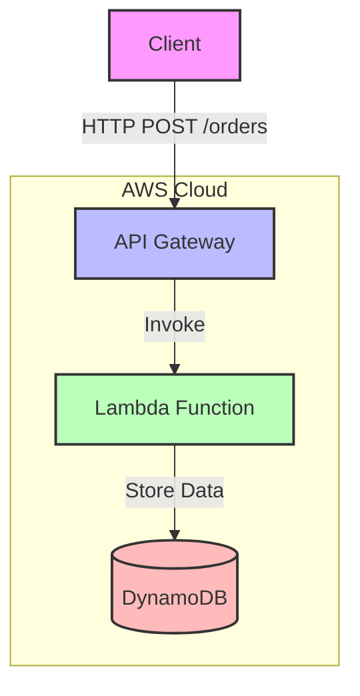

# E-commerce Serverless Application on AWS

## Project Status
🚧 **Work in Progress** - This project is currently under active development and not yet completed.

## Overview
This is a serverless e-commerce application built on AWS, utilizing various AWS services to create a scalable and cost-effective solution. The application follows a microservices architecture and is designed to handle order processing in a serverless environment.

## Architecture
The application is built using the following AWS services:
- AWS Lambda for serverless compute
- Amazon DynamoDB for data storage
- Amazon API Gateway for REST API endpoints
- AWS CloudFormation for infrastructure as code

### Architecture Diagram


## Current Features
- Order creation endpoint
- Serverless architecture
- Infrastructure as Code (IaC) using CloudFormation

## Project Structure
```
.
├── infrastructure/           # AWS infrastructure definitions
│   ├── api-gateway.yaml     # API Gateway configuration
│   ├── lambda/              # Lambda function configurations
│   └── dynamodb/            # DynamoDB table definitions
├── services/                # Application services
│   └── create-order/        # Order creation service
└── .gitignore              # Git ignore rules
```

## API Endpoints
Currently implemented endpoints:
- `POST /orders` - Create a new order

## Getting Started
1. Ensure you have AWS CLI configured with appropriate credentials
2. Deploy the infrastructure using CloudFormation
3. Access the API endpoints through the deployed API Gateway

## Development Status
This project is actively being developed. The following features are planned or in progress:
- [ ] Additional order management endpoints
- [ ] Payment processing integration
- [ ] User authentication and authorization
- [ ] Product catalog management
- [ ] Order status tracking
- [ ] Analytics and reporting

